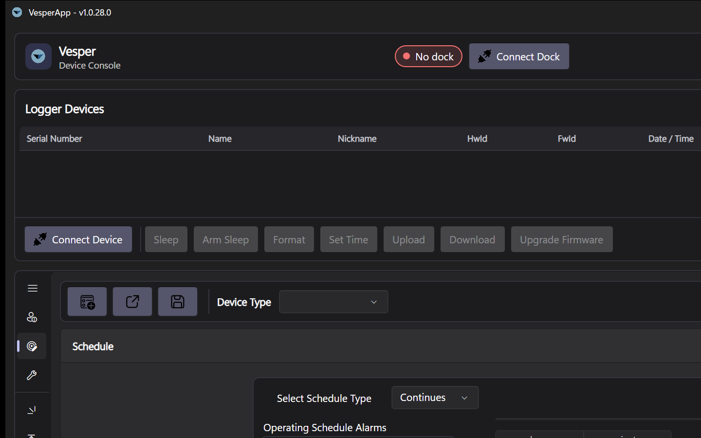
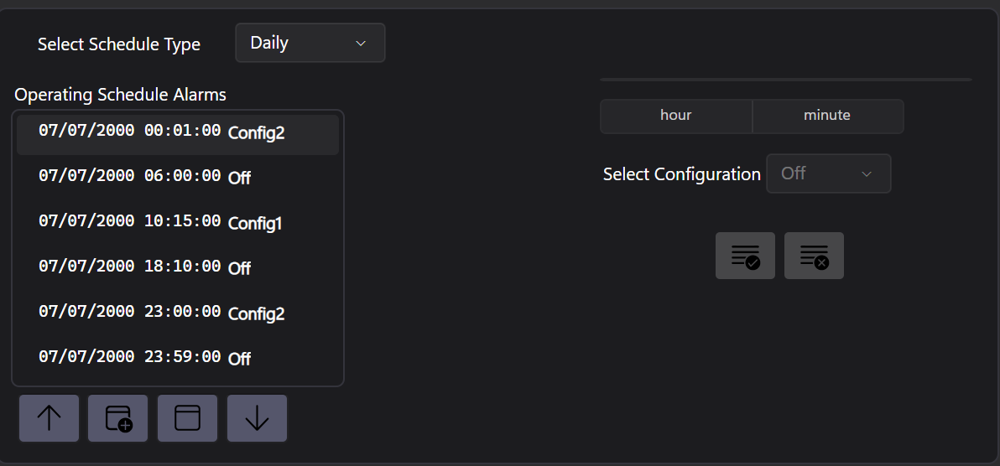

# Configuration Editor

The **Configuration** tab edits the JSON configuration that tells a device *what to record and when*. You can load a configuration from a file, adjust it, and save it back.



*The Configuration tab: device type selection, schedule editor and per-sensor driver settings.*

## General device settings

| Setting | Meaning |
|---|---|
| **Device name** | Device name - used by the device to validate the configuration matches target device; this is autopopulted by Device pick |
| **Minimum hardware** | The hardware revision this configuration requires (e.g. `4.0`) |
| **Allow magnet turn-off** | Whether a magnet may power the device down in the field (after activation) |
| **Battery capacity** | The fitted battery's capacity in mAh (informational, used for documentation - no real impact on execution) |
| **Power-on time/delay** | Optional power-on time/delay after magnet activation - when the device becomes active — an absolute date/time or relative delay |
| **Clock drift** | Fine RTC clock-drift compensation constant for the Vesper/KOL products (consult for details); leave empty to disable compensation |

Selecting a device type pre-fills the device name and clock drift (Vesper, Pipistrelle and KOL use `32999`; Nanotag has none) — both can be adjusted before saving.

## Recording schedules

There are 4 types of schedules supported:

| Type | Behaviour |
|---|---|
| **Continuous** | Record continuously after activation while powered. Can be stopped manually via magnet if enabled on the General section. |
| **Daily** | Repeat the same time windows every 24HR; schdule runs 00:00 to 23:59 if entry should run over midnight, split it till 23:59 and after 00:00 |
| **Dated** | Run in specific calendar windows based on absolute dates |
| **Relative** | Windows relative to date of magnet activation with dates relative to date of activation (1,2,3...) |

A configuration contains one or more **schedule blocks** marked as **config0 (Off)**, **config1 (On)**, **config2 (On)**.
Blocks define when each sensor records, so you can, for example, record audio only at night while sampling environment sensors around the clock.  
**Continues** schedule type always uses **config1** block, while **Daily**, **Dated** and **Relative** schedule types use **config1** and **config2** blocks as needed.

Schedule is edited in the **Schedule** tab, which shows a visual representation of the schedule blocks. The schedule consists of array of JSON objects where each object represents a change in state entry, and you can also edit the JSON directly.
  
This example shows a daily schedule with two blocks: **config1** (On) from 10:15 to 18:10, and **config2** (On) from 23:00 to 06:00. The rest of the time the device is in **config0** (Off) state. Note - to defined overnight rollover, the schedule split from 23:00 to 23:59 and from 00:01 to 06:00.  
Same can be achieved with manually editing the JSON schedule array, for example:
```json
[
    {"time":"2000-07-07 00:01:00","config":2},
    {"time":"2000-07-07 06:00:00","config":0},
    {"time":"2000-07-07 10:15:00","config":1},
    {"time":"2000-07-07 18:10:00","config":0},
    {"time":"2000-07-07 23:00:00","config":2},
    {"time":"2000-07-07 23:59:00","config":0}
]
```

## Sensor drivers

Each sensor on the device is configured through its **driver** entry — sampling rate, gain, channel selection and other per-sensor options. The property editor renders every driver's options directly from the device's own metadata, so new sensor types appear automatically with the correct choices. Typical drivers include the audio front-end, IMU, EXG (48-channel or 2-channel 1292 variants), environmental sensors, ambient light and proximity.

For the KOL's microphone array, the channel configuration (1, 2 or 4 microphones) is part of the audio driver settings.

## Saving and applying

- **Save** writes the configuration JSON — to a file, or to the connected device.
- Configurations are portable: you can prepare them offline and apply them to a whole batch of devices at the bench.
