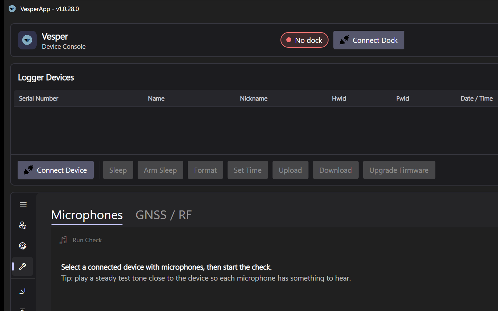

# Device Tests

The **Device Tests** tab bundles per-sensor hardware checks you can run before a deployment. Tests are capability-driven: only the checks a connected product actually supports are offered.

*The Device Tests tab. With a device connected, the microphone health check and (on VT04-VESPER) the GNSS/RF self-test become available.*

## Microphone health check

Verifies that each microphone on the device responds with a healthy signal-to-noise ratio. Available on all products with microphones (Vesper, Pipistrelle, KOL).

**How to run it**

1. Connect the device (via the dock) and select it.
2. For KOL, choose the microphone configuration to test (1, 2 or 4 mics); single-mic products test their one microphone.
3. Press **Run**.
4. When prompted, play a **steady tone** near the device — a phone tone-generator app or a speaker works fine. The test listens for in-band test tones at 1 kHz and 4 kHz over a short 200 ms capture.

**Reading the results**

Each microphone gets a row with its status, measured SNR (dB) and noise floor:

- **OK** — all test tones exceeded the health threshold (12 dB SNR).
- **Problem** — the mic responded but below threshold; check for blocked ports, membrane damage or debris and re-run.
- **No response** — the channel returned no usable signal; the microphone or its wiring is likely faulty.

A summary line reports *"X of Y microphone(s) healthy"*. The threshold is deliberately lenient — this is a field health check, not a calibrated factory measurement.

## GNSS / RF self-test (Vesper / Nanotag)

Exercises the GNSS receive chain in the device's own firmware. This is a **bench test**: it expects a controlled RF environment (a shielded enclosure with a signal generator such as an ADALM-Pluto coupled in), and is primarily used in production and service settings.

Two checks are available:

- **Tone self-test** — the device captures an RF snapshot and must detect a continuous-wave test tone. Reported: pass/fail status, carrier-to-noise density (C/N0), and the measured TCXO frequency offset. Tone offset, generator gain, SNR threshold and snapshot length (64/128/256 ms) are adjustable.
- **Positioning test** — a recorded GPS scenario is transmitted to the device; the device's snapshot is decoded and the resulting fix is compared against the scenario's reference coordinates within a tolerance (default 500 m). Reported: latitude, longitude, accuracy and satellite count.

If you only need to confirm end-to-end GNSS on real sky, a normal snapshot recording outdoors followed by [GNSS Decoding](GNSS-Decoding) is the simpler route.

**Note: *All the self test features are experimental and may not be available on all devices or firmware versions.**
