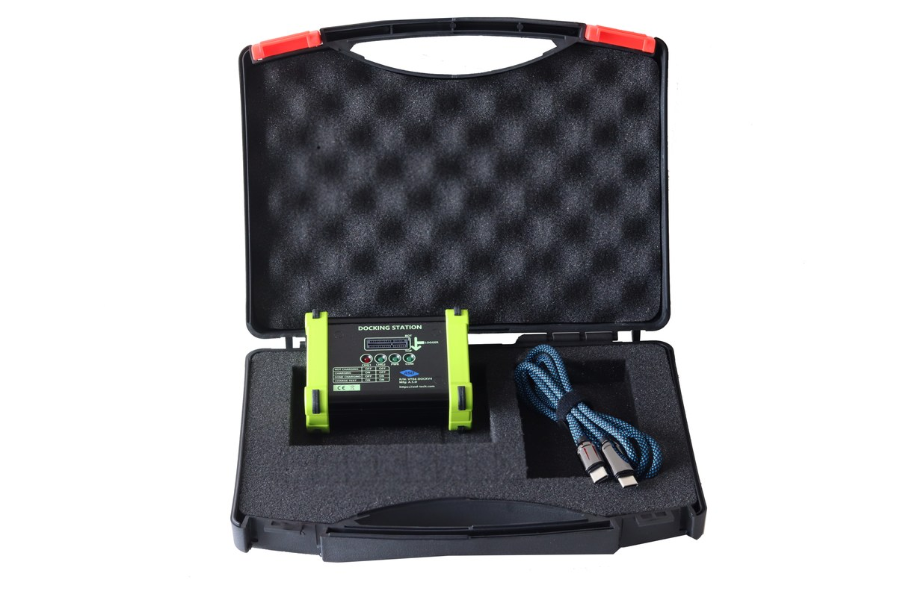

# Docking Station

The **ASD Docking Station** is the bench-side companion to the loggers: it holds a device, powers it, and gives the host computer controlled access to the device's USB interface — including the low-level boot control needed for firmware flashing.

*The docking station kit (VT04-DOCKV4): dock with logger slot and status LEDs, USB cable, carrying case.*

## What the dock does

The dock (current hardware **VT04-DOCKV4**) appears to the computer as a customized FTDI USB serial bridge (FT232R, USB ID `0403:6001`). The logger board slides into the card-edge **LOGGER slot** on the faceplate — match the **TOP** marking on the board's silkscreen with the TOP side printed next to the slot. While docked, the device is powered and its battery is charged.

Beyond passing the device's own USB connection through to the host, the dock drives three control lines into the docked device:

| Line | Function |
|---|---|
| **VEN** | Device power enable — the dock can power the device up and down |
| **BOOT0** | Boot-mode select — forces the device into its built-in system bootloader |
| **NRST** | Reset — pulses the device's reset line |

These lines are what make **hands-free firmware updates** possible: when you flash firmware, the app uses the dock to power the device, hold BOOT0, and pulse reset so the device re-enumerates in DFU bootloader mode — no buttons, jumpers or manual resets required. See [Firmware Updates](Firmware-Updates).

## Status LEDs

The faceplate carries four LEDs:

| LED | Meaning |
|---|---|
| **PWR** (green) | Dock is powered |
| **COM** (green) | Communication with the host / device |
| **CHG1** (red) + **CHG2** (green) | Charge state of the docked device — see below |

| CHG1 | CHG2 | Charge state |
|---|---|---|
| off | off | Not charging |
| on | off | Charging |
| off | on | Done charging |
| on | on | Charge test |

## Connecting the dock

1. Plug the dock into the computer with a USB cable. On Windows the FTDI driver installs automatically on first use; on Linux/macOS no driver is needed.
2. In VesperApp, press the dock **Connect** button.
3. If several docks are attached, a picker dialog lists them by **serial number** — choose the one you want. Each dock has a unique serial, so multi-dock bench setups are supported.
4. Insert the device into the dock bay. The app detects the device and lists it with its type, serial and status.

To release the hardware for other software, use **Disconnect**.

## Operations that require the dock

| Operation | Dock required? |
|---|---|
| Firmware flashing of VT04-VESPER / VT04-PP / KOL | **Yes** — the DFU boot sequence is driven through the dock's control lines |
| Recording import from device storage | Yes, for docked products |
| Configuration read/write | Yes, for docked products |
| Device Tests (mic health, GNSS self-test) | Yes, for docked products |
| Nanotag operations | No — the Nanotag connects over its own USB interface |
| App/plugin updates, decoding already-imported data | No |

## Care and usage notes

- Keep the device seated firmly in the dock during firmware updates; a connection dropout mid-flash is recoverable (the device stays in its ROM bootloader) but forces a retry.
- The dock itself contains no upgradable firmware — it is a passive USB bridge with control lines, so there is never a "dock firmware update".
- If the dock is not detected, see [Troubleshooting and FAQ](Troubleshooting-and-FAQ).
