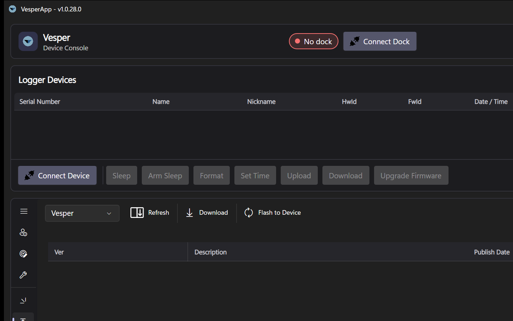

# Firmware Updates

The **Firmware Upgrades** tab downloads released device firmware and flashes it — through the docking station for the VT04 family, or directly over USB for the Nanotag.

*The Firmware Upgrades tab: pick the device type, download a release from the feed, then Flash.*

## Getting firmware

1. Open **Firmware Upgrades** and pick your **device type** (VT04-VESPER, VT04-PP, KOL or Nanotag). The release list filters to that product, showing each release's **version**, name, release notes and publish date.
2. Select a release and press **Download**. Firmware comes from the official release feed over HTTPS and every download is integrity-checked (SHA-256) before it can be flashed.

VT04-VESPER and VT04-PP share the same firmware — the board is auto-detected at runtime — so the same releases appear under both device types.

## Flashing a VT04-VESPER / VT04-PP / KOL

These devices flash over **USB DFU** using the ST system bootloader, and the whole boot-mode dance is automated by the [docking station](Docking-Station):

1. Connect the dock and seat the device in it.
2. With a downloaded release selected, press **Flash**.
3. The app powers the device through the dock, holds the boot-select line and pulses reset — the device re-appears as an ST DFU bootloader, the firmware is written and verified, and the device is reset back into normal operation.
4. The progress bar runs from entering the bootloader through writing to the final reset. When it completes, the device boots the new firmware.

Supported firmware file formats: `.dfu` (DfuSe), `.hex` (Intel HEX) and raw `.bin` images. Images are automatically padded and aligned to the STM32U5's 16-byte flash programming granularity before writing — no preparation of the file is needed.

**During the flash:** leave the device seated and the dock plugged in. If the process is interrupted or fails, the device cannot be bricked: the boot line is always restored and the device stays recoverable through its ROM bootloader — simply run the flash again.

**First flash on a Windows machine:** the very first time the bootloader appears, Windows may take a while to bind its driver — the app waits up to 20 seconds. If it consistently reports that a DFU device was detected but could not be opened, install the "STM32 BOOTLOADER" WinUSB driver (included with STM32CubeProgrammer) once.

## Flashing a Nanotag

The Nanotag uses a USB-HID bootloader and needs **no dock**:

1. Connect the Nanotag over USB.
2. Select the downloaded Nanotag release and press **Flash**.
3. The app commands the tag into its bootloader, programs the image, verifies it with a CRC check, and restarts the tag into the new firmware.

Nanotag firmware is distributed as Intel HEX (`.hex`) files.

## After flashing

- Reconnect / re-detect the device and confirm the reported firmware version.
- Device configurations are independent of firmware, but after a major firmware upgrade it is good practice to reload and re-save your configuration ([Configuration Editor](Configuration-Editor)) and run a [mic health check](Device-Tests).

