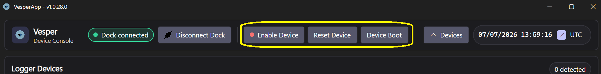

# Getting Started

## Requirements

- **Windows 10/11 (x64)**, **macOS (Apple Silicon)** or **Linux (x64)**.
- A free USB-A/USB-C port for the docking station or a directly connected device.
- On Windows, the FTDI D2XX driver for the docking station (normally installed automatically by Windows Update when the dock is first plugged in).

The application is self-contained — no separate .NET installation is required.

## Installation

1. Download the installer for your platform from the release channel you were given (stable is recommended; beta receives earlier builds).
2. Run the installer. The app installs per-user and keeps itself up to date automatically — see [Software Updates and Plugins](Software-Updates-and-Plugins).
3. Launch **VesperApp**.

## First run

On first launch the app creates:

- A **working directory** at `Documents/MyVesperData` in your user profile (same on Windows, macOS and Linux) — this is where imported recordings and decoded output are stored. You can change it in [Settings](Settings).
- A configuration file `config.json` holding your preferences, in the app's data folder:

| Platform | App data folder |
|---|---|
| Windows | `%LOCALAPPDATA%\VesperApp` |
| macOS | `~/Library/Application Support/VesperApp` |
| Linux | `~/.local/share/VesperApp` (respects `$XDG_DATA_HOME`) |

*The main window: docking station controls, device console and logger list on top, the active tab below, and the tab navigation on the left edge.*

The **Devices** button in the top-right corner collapses the device console when you're doing offline work (editing configurations, decoding recordings, reading Help) so the working area gets the full window height. The console re-opens automatically when a docking station connects, and the choice is remembered between sessions.

The left-hand navigation gives you the main areas of the app:

| Tab | Purpose |
|---|---|
| **Recordings** | Import, parse and decode device recordings |
| **Configuration** | Edit a recording schedule and sensor setup configuration file |
| **Device Tests** | Per-sensor checks to vaidate hardware  (microphones, GNSS/RF) |
| **Software Upgrades** | Update the VesperApp itself |
| **Firmware Upgrades** | Download and flash device firmware |
| **Plugins** | Manage the GNSS decoder and other plugins |
| **Settings** | Application preferences |
| **Help** | This documentation, fetched live from the project wiki |

The tab shown at startup is configurable in [Settings](Settings).

## Connecting hardware

1. Plug the **docking station** (in case of a device does not have a built-in USB port) into a USB port (see [Docking Station](Docking-Station)).
2. Insert your device into the dock, or connect a device directly over USB where supported (see [Supported Devices](Supported-Devices)).
3. Use the dock **Connect** button in the app. If more than one dock is attached you will be asked to pick one by serial number.

Once connected, use Docking Station controls to manipulate the device (for example turn it on using **Device Enable**; the device appears in the device list and its battery, storage and firmware details become available.  

## A typical session

1. **Connect** the dock and device.
2. Optionally **reconfigure** the device for its next deployment byt copy an existing configuration file to the device or use ([Configuration Editor](Configuration-Editor)) to create a new one.
3. Optionally run a quick [hardware verification test](Device-Tests).
4. Deploy the device in the field / lab accordint to specifications and activate the recording schedule.
5. Once the device is retreived, reconnect and reestablish conenction per device's documentaion. 
6. **Import** the device's recordings in the **Recordings** tab — with *Auto Decode* enabled, raw files are parsed and decoded to WAV/CSV in one step ([Recordings](Recordings)).
7. Review decoded output in your working directory.
