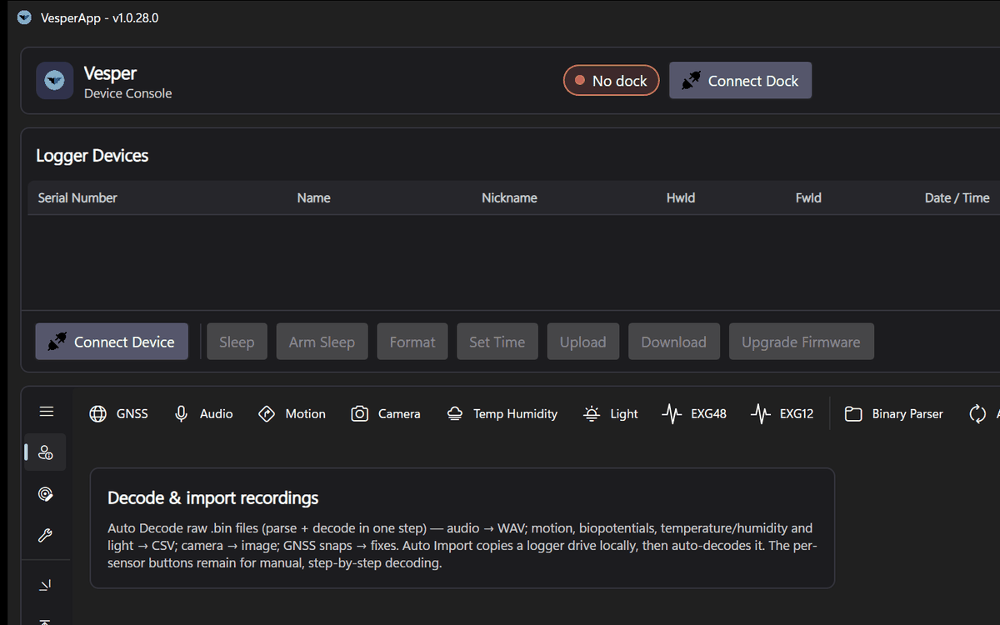
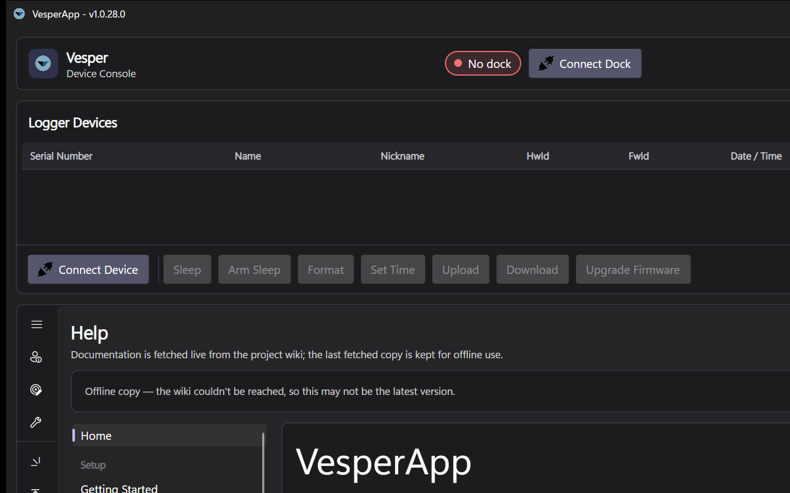

# VesperApp

**VesperApp** is the cross-platform open source desktop suite (Windows / macOS1/ Linux2) for working with ASD (https://www.asd-tech.com) scientific data loggers, tags, wildlife monitoring and other devices like — **[Vesper](https://asd-tech.com/product/vt04-vesper/)**, **[Pipistrelle](https://asd-tech.com/product/vt04-pp/)**, **[KOL](https://asd-tech.com/product/vt04-kol-dk/)**, **[Nanotag](https://asd-tech.com/product/sp04-nanotag/)** and more, combined together with the **ASD Docking Station** and other tools.
This documentation is not a substitute for the official user manuals of the devices, which are available on the ASD website not for picking up the right product(s) for the right task, please [contact us](https://asd-tech.com/contact-us/).  

*This documentation is a work in progress. If you find something missing or unclear, please [open an issue](https://github.com/ASD-Alexander-Schwartz-Developments/VesperAppCode/issues)*

**VesperApp** is designed to be a one-stop solution for managing your devices and their data.
From one application you can:

- **Configure devices** — recording schedules, sensor drivers and power behaviour — through a guided configuration editor.
- **Import, parse and decode recordings** from a device's storage into WAV audio, CSV sensor data, thermal-camera images and GNSS position fixes.
- **Test hardware** with built-in per-sensor checks (microphone health, GNSS/RF self-test).
- **Update firmware** on devices through the docking station, and keep the app itself and its plugins up to date.

*A quick tour of the main tabs: Recordings, Configuration, Device Tests, updates and Help.*

## Where to start

| I want to… | Read |
|---|---|
| Install the app and set it up | [Getting Started](Getting-Started) |
| Understand the hardware | [Docking Station](Docking-Station) · [Supported Devices](Supported-Devices) |
| Get data off a device | [Recordings](Recordings) |
| Decode GNSS snapshots | [GNSS Decoding](GNSS-Decoding) |
| Configure a device's schedule | [Configuration Editor](Configuration-Editor) |
| Check microphones or GNSS | [Device Tests](Device-Tests) |
| Update device firmware | [Firmware Updates](Firmware-Updates) |
| Update the app or plugins | [Software Updates and Plugins](Software-Updates-and-Plugins) |
| Change app preferences | [Settings](Settings) |
| Fix a problem | [Troubleshooting and FAQ](Troubleshooting-and-FAQ) |

## About this documentation

These pages document the VesperApp host software and the accompanying docking-station hardware. The same content is available inside the application under **Help** (fetched live from this wiki also hosted at: https://github.com/ASD-Alexander-Schwartz-Developments/VesperAppCode/wiki, with an offline cache).

*1.macOS support is by cross paltform design and is not verified/guaranteed.*
*1.Linux support is by cross paltform design and only partially verified on latest Ubuntu LTS.*

VesperApp is an open-core application: the shell, device protocols and recording pipeline are open source, while cloud sync and the GNSS decoder ship as optional proprietary plugins. See the repository's `docs/ARCHITECTURE.md` for the developer-facing design document.
