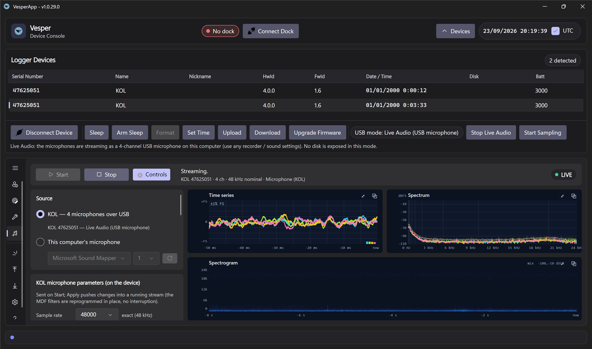
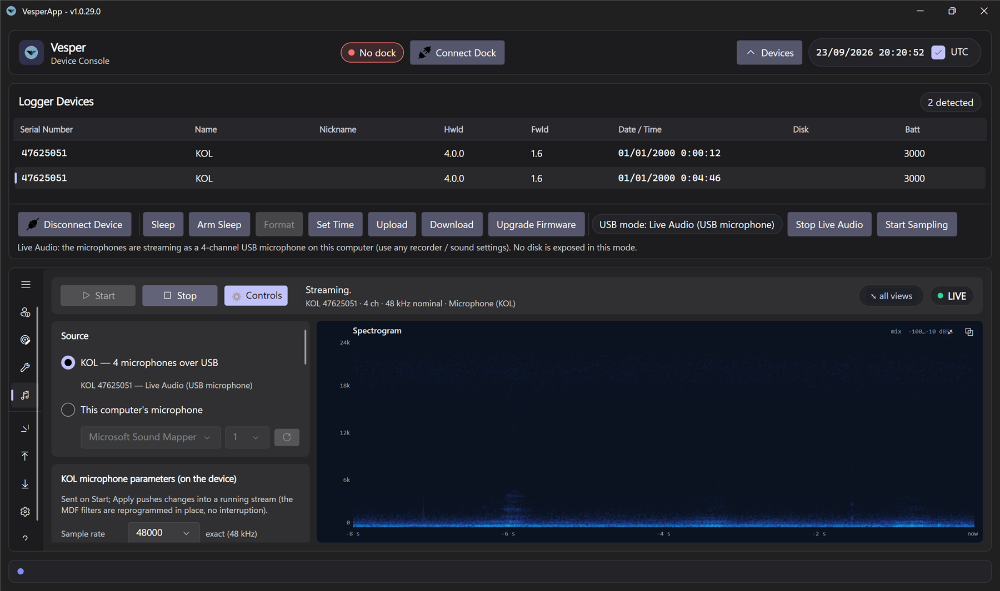
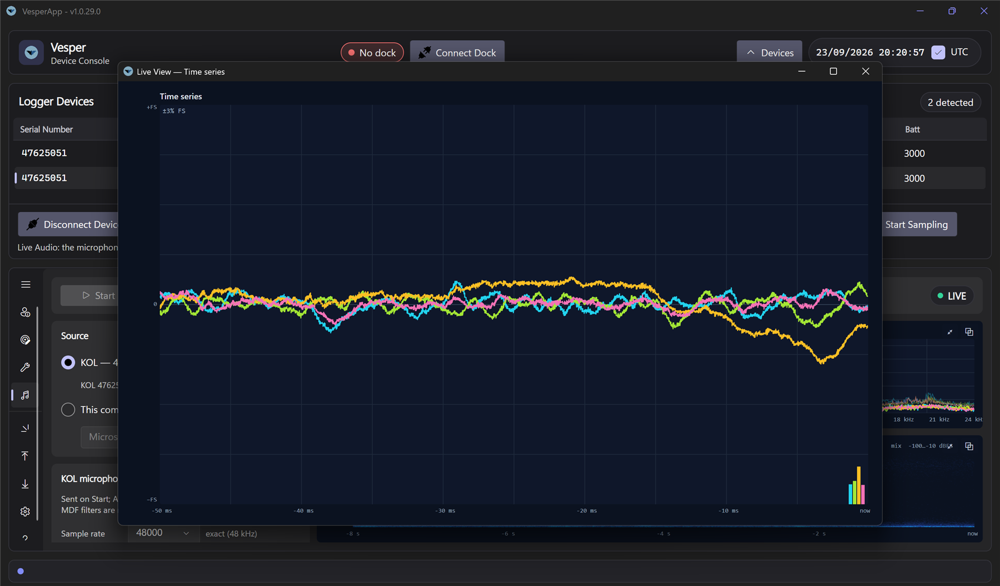

# Live View

The **Live View** tab shows what a device's microphones hear, right now: a multi-channel oscilloscope, a spectrum analyser and a scrolling spectrogram, fed either by a **KOL streaming its four microphones over USB** or by any microphone of your computer. It is meant for demonstrations, sanity checks in the field (is every channel alive? is the gain right?) and quick listening sessions before a deployment — not for calibrated measurements.

*Live View with a KOL streaming: time series and spectrum of all four channels on top, the spectrogram of one channel below; settings on the left.*

## Sources

| Source | What happens on Start |
|---|---|
| **KOL — 4 microphones over USB** | The app sends your microphone parameters to the device, switches it to **Live Audio** mode if needed (it briefly re-enumerates as a 4-channel USB microphone, see [Supported Devices](Supported-Devices)), waits for the microphone to appear and opens it at the selected sample rate. Requires a KOL connected on its USB console (Idle or Live Audio). |
| **This computer's microphone** | Opens the selected input at its native rate; choose 1 or 2 channels. Useful to try the instruments without a device. |

Press **Stop** to freeze the display on the last samples; **KOL → Idle** returns the device to console + disk mode.

## KOL microphone parameters

These settings live **on the device** (they are the same fields as `gain`, `hpf`, `filter`, `cic4` in `config.json`, so what you see live is what a recording with those values would capture):

- **Sample rate** — 8, 16, 32, 48 or 96 kHz nominal. The device's decimator is integer-ratio, so some rates are approximate; the note next to the selector tells you the exact rate the hardware delivers (e.g. 96 kHz runs at 100 kHz).
- **Gain** — in 3 dB steps from −48 to +72 dB. The deployed default is +36 dB. Too much gain shows as a flat-topped time series and a "SATURATING" flag when you press **Read**.
- **High-pass** — off, or one of four cutoffs relative to the sample rate; removes the microphones' DC offset and rumble.
- **Reshape filter** and **CIC filter** — the decimator's shaping stages; leave at the defaults unless you know why.

**Apply** pushes changes into a running stream immediately (the device reprograms its filters in place, no interruption); **Read** loads the device's current values. Changes are kept in the device's RAM only — a reset restores `config.json`.

## Instruments

- **Time series** — the last 5 ms … 1 s of every enabled channel, one colour per channel, with a peak meter per channel on the right. Auto-scales to the signal.
- **Spectrum** — magnitude spectrum in dBFS of the enabled channels with a slow peak-hold trace; linear or logarithmic frequency axis; FFT size 1 k–8 k.
- **Spectrogram** — scrolling waterfall of the selected channel (or the mix of all channels) over 4–60 s; adjust the floor to pull quiet detail out of the noise.

Every instrument has two buttons in its corner: **⤢ Focus** makes it fill the whole area (press again, or "⤡ all views" in the toolbar, to go back) and **⧉ Pop out** opens it in its own resizable window — handy on a second screen or a projector. **⚙ Controls** hides the settings column.

*Focus: the spectrogram alone fills the instrument area; "⤡ all views" in the toolbar restores the grid.*

*Pop out: the time series in its own window, still following the same stream and settings.*

## Local processing (optional)

Switch on **Local processing** to filter the received samples *on the computer* before they reach the instruments and the recognizer. The device stream itself is not changed.

- **Post gain** −30 … +40 dB.
- **High-pass** / **Low-pass** — Butterworth filters of order 2, 4, 6 or 8 with a free cutoff frequency; the low-pass doubles as an anti-alias / band-limit filter for the display.
- **Mains notch** — 50 or 60 Hz with 1 … 8 harmonics.

The line under the controls summarises the active chain.

## Sound recognition

While streaming, the recognizer analyses the **last second of the selected channel (or mix)** every 0.6 s and shows its ranked guesses with confidence bars; whenever the top guess changes it is written to the **detection log** with a timestamp. Nothing to start — switch it off with the toggle if you do not need it.

The built-in model is a **demo heuristic**: it distinguishes broad sound classes (bat echolocation, bird song, insect stridulation, human speech, mains hum, mechanical noise, wind/rain, clicks) from spectral and temporal rules. It is not species identification. A trained model — for example BirdNET or a bat-call classifier exported as ONNX — can replace it as a plugin implementing `ISoundClassifier`; when such a plugin is installed its name appears in the panel and the warning disappears.

## Tips

- Live View audio capture is available in the 64-bit Windows and Linux builds only; the 32-bit
  Windows build shows "Audio backend unavailable" (no 32-bit audio library), everything else
  in the app works there. On Linux install the ALSA and JACK client libraries first, see
  [Linux Setup](Linux-Setup).
- On Windows the KOL microphone is opened through the WDM-KS path, which is the only one exposing all four channels; if another application holds the microphone exclusively, Start reports it — close that application and try again.
- The channel order is the same as in recordings: channel 0 and 1 are the two microphones on the "WE" line, 2 and 3 the two on the "NS" line (files `U0`…`U3`).
- Use **Read** after connecting to see the device's deployed parameters before changing anything.
