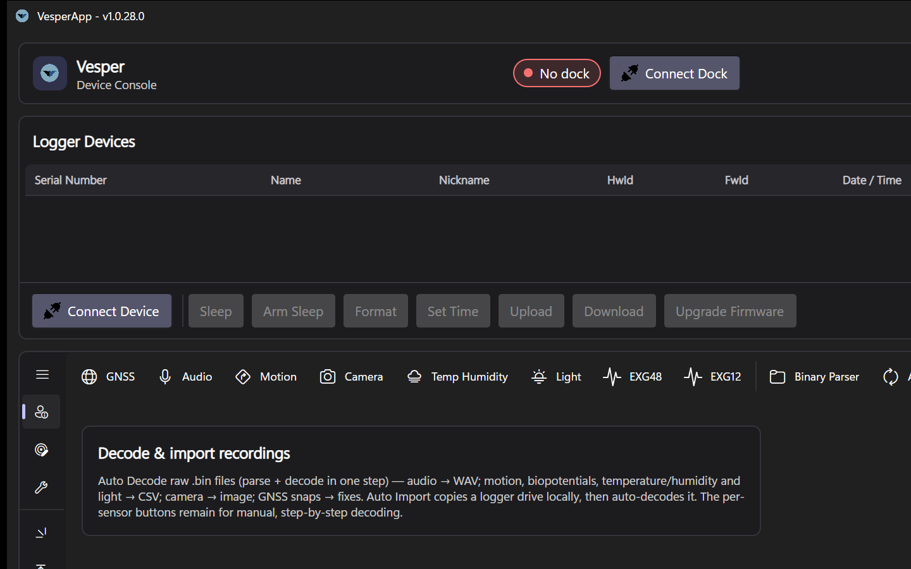

# Recordings

The **Recordings** tab is where device data becomes usable files: it imports raw recordings from a device, parses them into per-sensor streams, and decodes those streams into WAV audio, CSV tables and images.



*The Recordings tab, with per-sensor decode actions (GNSS, Audio, Motion, Camera, Temp Humidity, Light, EXG) and the one-step Auto Decode/Auto Import workflow.*

## The pipeline at a glance

```
device storage          working directory
   *.BIN      ──import──►  raw .bin files
                ──parse──►  per-sensor intermediates (.UBN, .MBN, .EBN, …)
               ──decode──►  WAV / CSV / JPG / GNSS fixes
```

1. **Import** copies the raw `*.BIN` recording files from the connected device into your working directory (organised per recording session).
2. **Parse** (phase 1) splits each raw file by sensor type into intermediate files — audio becomes `.UBN`, motion `.MBN`, EXG `.EBN`, environment `.RBN`, light `.LBN`, thermal `.CBN`, and VT04-VESPER GNSS snapshots are extracted into a `DAT` folder.
3. **Decode** (phase 2) turns intermediates into final output: `.UBN` → **WAV**, `.MBN`/`.EBN`/`.RBN`/`.LBN` → **CSV**, `.CBN` → **JPG**, and `DAT` folders are handed to the GNSS decoder plugin ([GNSS Decoding](GNSS-Decoding)).

## Auto Import and Auto Decode

- **Auto Import** opens a guided two-step dialog:
  1. **Select the device drive** — removable drives are detected automatically and identified by the `UID.txt` the firmware writes on the drive (device ID, recording count and date are shown). The most likely drive is pre-selected; a Browse button covers importing from any folder.
  2. **Import to** — the target is pre-filled from your working directory as `<device ID>/<recording date>`, so every session lands in a consistent structure. Edit the path or browse if you want it elsewhere.

  Everything on the drive is imported — including the device's configuration file and `UID.txt` — so each imported session documents which device and configuration produced it. The per-sensor folder structure (`gps`, `aud`, `imu`, …) is preserved, while the device's internal auto-incrementing chunk folders (`0`, `1`, `2`, … holding 256 files each) are flattened away — each sensor's recordings land in a single flat folder.

- **Auto Decode** (Settings → Recordings) chains parsing and decoding onto every import, so a single action takes you from device storage to WAV/CSV output. Progress is shown in the **Decoding Progress** panel (0–50 % parsing, 50–100 % decoding).

Both can be combined with the Settings options *Hide intermediate files* and *Delete raw .bin after successful import* to keep the data browser tidy ([Settings](Settings)).

## Manual operation

You can also drive each stage by hand:

- Point the data browser at any folder containing raw `.bin` files and run **Parse** on it.
- Run **Decode** on a folder of intermediates — useful for re-decoding with different options or after installing the GNSS plugin.
- Use **Manual GPS Parser** on a `DAT` folder to launch a GNSS decode job explicitly.

## Watching progress

Every parse/decode run appears as a job in the non-modal **Decoding Progress** panel:

- live progress bar and elapsed time,
- a scrolling console tail of the decoder's output,
- **Open Log** to inspect the full log file (`logs/gnss/` in the app data folder for GNSS jobs — see [Troubleshooting and FAQ](Troubleshooting-and-FAQ) for per-platform locations),
- **Cancel** while running, **Remove** when finished.

Several jobs can run and be monitored at once; you can keep working in other tabs while they run.

## Where files go

Everything lands in your **working directory** (default `Documents/MyVesperData`, configurable in [Settings](Settings)), preserving a per-session folder structure with per-sensor subfolders (`AUD`, `IMU`, `EXG`, `TPRH`, `ALS`, `THCAM`, `DAT`, …).

## The live data browser

The Recordings tab's browser is a **live view of the working directory**: it opens there on every start (the full path is shown in the bar above the tree) and follows changes on disk automatically — imports, decodes, or files added by other programs appear within a second, with the tree's expansion state preserved. No manual refresh is needed or offered.

The tree has four columns — **Name**, **Type**, **Size** and **Modified**. Click a column header to sort by it (click again to reverse); folders always sort before files, at every level. The Type column identifies raw recordings by their sensor (GPS, Audio, Motion, …), parsed intermediates, and decoded outputs. Known sensor folders are labelled (Audio, Motion, GNSS, …); metadata sidecars are hidden, and intermediates can be hidden too ([Settings](Settings)).

Double-click behaviour:

- **Folder** — expand / collapse.
- **Configuration `.json`** — if the file is recognised as a device configuration, the app offers to open it in the [Configuration editor](Configuration-Editor) (with a confirmation, since unsaved editor changes would be lost). Other `.json` files open normally.
- **Any other file** — open with the OS default application.

Right-click a selection (multi-select works) for actions:

| Action | Effect |
|---|---|
| **Decode** | Raw `.bin` → parse + decode; intermediates / `DAT` folders → decode. Folders decode everything under them. |
| **Parse only** | Strip/split raw `.bin` into intermediates without decoding |
| **Open** | Open the file/folder with the OS default app |
| **Open in system file explorer** | Open the folder (or the file's folder) in the OS file manager — Explorer, Finder or the Linux default |
| **Delete…** | Delete the selection from disk (with confirmation) |

Right-clicking selects the row under the cursor, so the menu always acts on what you clicked. Selection actions and the toolbar's file-picker buttons feed the same decoders — use whichever fits the moment.

## Raw file format reference

Internal details of the on-device `.bin` files — useful when debugging a parse or handling recordings outside the app.

### File naming

Devices write raw files as `XXXC.bin`, where `XXX` is a sequential number and `C` a single letter identifying the sensor:

| Letter | Sensor |
|---|---|
| `G` | GPS |
| `U`, `U0`–`U3` | Audio (`U0`–`U3` on multichannel recorders like KOL) |
| `M` | IMU modules |
| `E` | Biopotential (EEG / ECG / EMG) |
| `R` | Temperature & humidity |
| `L` | Ambient light |
| `X` | Proximity |
| `O` | Log |
| `S` | Analog DAQ |
| `C` | Cameras |

### Standard binary layout

All sensor files except camera, GPS and proximity share one structure — a 128-byte file header followed by one or more data blocks (there may be time gaps between blocks):

```
| 128-byte file header | [ 16-byte block header | data | 16-byte optional sync | data | 16-byte block footer ] …
```

The file header is identified by the signature `0xDEAFDAC0`; all fields are **little endian**. It carries:

| Field | Size |
|---|---|
| Device unique identifier | 32-bit |
| Device name | 16 × 8-bit ASCII |
| Firmware version | 16-bit |
| Hardware version | 16-bit |
| Sampling rate | 32-bit |
| Window rate | 32-bit |
| Window length | 32-bit |
| Bitmask | 32-bit |
| Configuration data 0–3 | 4 × 32-bit |

### GPS snapshot files

GPS `.bin` files differ: a 1024-byte metadata header followed by raw I/Q sample data. The metadata starts with a 16-byte header carrying the magic word `0xA55AA55A`:

```
| 32-bit magic word | 32-bit time | 32-bit date | 16-bit subsecond fraction | 16-bit subsecond |
```

- **Time** packs hours, minutes, seconds and a reserved byte (8-bit each).
- **Date** packs a reserved byte, month, day and year (8-bit each).

During parsing each snapshot is written out as `snap.YYYY_MM_dd_hh_mm_ss_GC0.dat` using the extracted timestamp — these are the `DAT` folders handed to the GNSS decoder plugin ([GNSS Decoding](GNSS-Decoding)).
