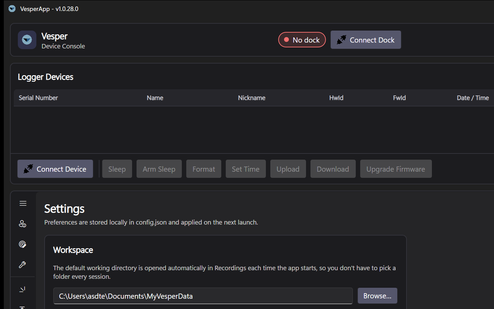

# Settings

The **Settings** tab holds this application (VesperApp) preferences. They are stored locally in `config.json` in the app's data folder — `%LOCALAPPDATA%\VesperApp` on Windows, `~/Library/Application Support/VesperApp` on macOS, `~/.local/share/VesperApp` on Linux — and take effect immediately or on the next launch as noted.

*The Settings tab: workspace, recordings pipeline options and the configuration file location.*

## Workspace

- **Working directory** — where imported recordings and decoded output live. Default: `Documents/MyVesperData`. Use **Browse…** to relocate it (existing data is not moved automatically). The Recordings data browser is always rooted here on startup and follows changes on disk live — see [Recordings](Recordings).

## Recordings

- **Auto-decode after import** — chain parsing and decoding onto every import ([Recordings](Recordings)).
- **Hide intermediate files** — hides `.UBN` / `.MBN` and other intermediates in the data browser so you only see raw input and final output.
- **Delete raw .bin files after a successful import** — reclaims disk space once recordings are safely parsed. Deletion is deliberately conservative: it only happens when **every** raw file of the import decoded without errors, it only touches the copies that this import brought into the working directory (never files already there, never the device drive), and it requires *Auto-decode after import* to be on. Only enable this if you don't need to re-parse originals.

## Configuration file

Shows the full path of the app's `config.json` and offers **Open config folder** for quick access — handy when backing up preferences or reporting an issue.

## Startup tab

The tab the app opens on (defaults to Recordings) is remembered in the configuration and can be pointed at any main tab.

Press **Save** to persist changes.
