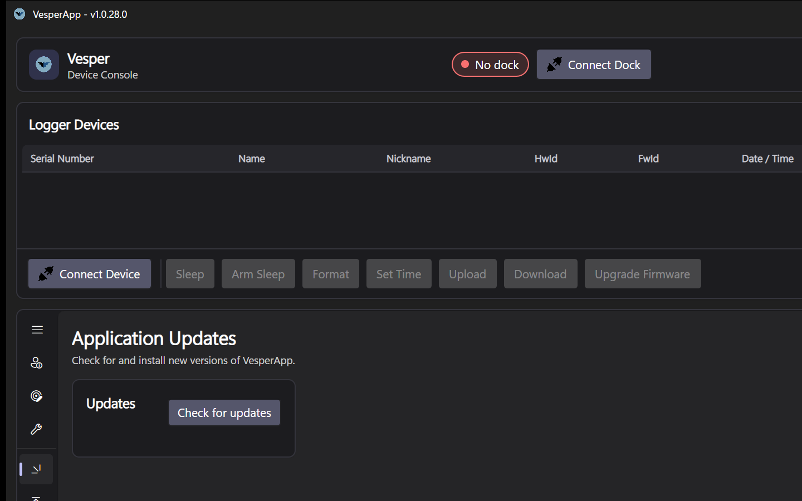
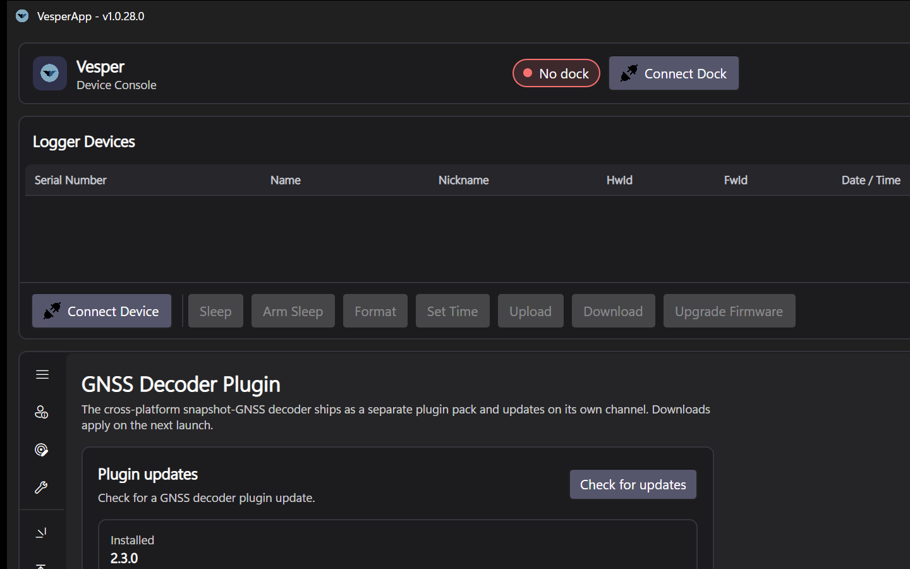

# Software Updates and Plugins

VesperApp keeps three things current, each on its own independent channel: the **application** itself, **device firmware** (covered in [Firmware Updates](Firmware-Updates)) and **plugins**.

## Updating the app

The **Software Upgrades** tab manages the application's own updates:

*The Software Upgrades tab.*

1. Press **Check Updates**. The app polls its release channel for your platform (stable or beta).
2. If a newer version exists, its version number is shown next to your installed version. Press **Download** — updates are delta-patched where possible, so downloads are small.
3. When the download finishes, press **Restart & Apply**. The app relaunches on the new version.

Updates are published per platform (Windows x64, macOS Apple Silicon, Linux x64) on **stable** and **beta** channels. Beta receives features earlier; stable is recommended for production benches.

## Plugins

Some functionality ships as optional plugins that install into your per-user plugin folder and update independently of the app. Today that is the **GNSS decoder plugin**, which enables [GNSS Decoding](GNSS-Decoding) of VT04-VESPER snapshots.

*The Plugins tab, showing the GNSS decoder plugin status and update channel.*

On the **Plugins** tab:

1. The page shows the plugin's installed version, or *not installed*.
2. Press **Check for updates** to poll the plugin feed.
3. If a new version is available, download it. Plugins are applied **on the next launch** — the page will indicate a pending restart.

Notes:

- Without the GNSS plugin, everything except GNSS decode works normally; GNSS decode simply reports that the plugin is not installed.
- Plugin packs are validated before loading (platform, compatibility version, integrity), so an incompatible pack is rejected cleanly rather than breaking the app.
- App updates never remove installed plugins — the two update paths are deliberately separate.

## Security model

All feeds and downloads go over HTTPS from the official distribution CDN, assets are SHA-256-verified after download, and the application contains **no embedded credentials**. Development builds without a configured feed simply report that update checking is unavailable.
