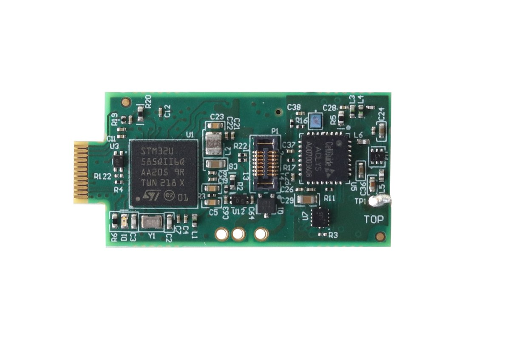
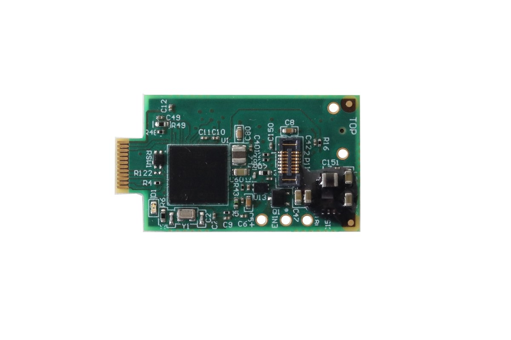
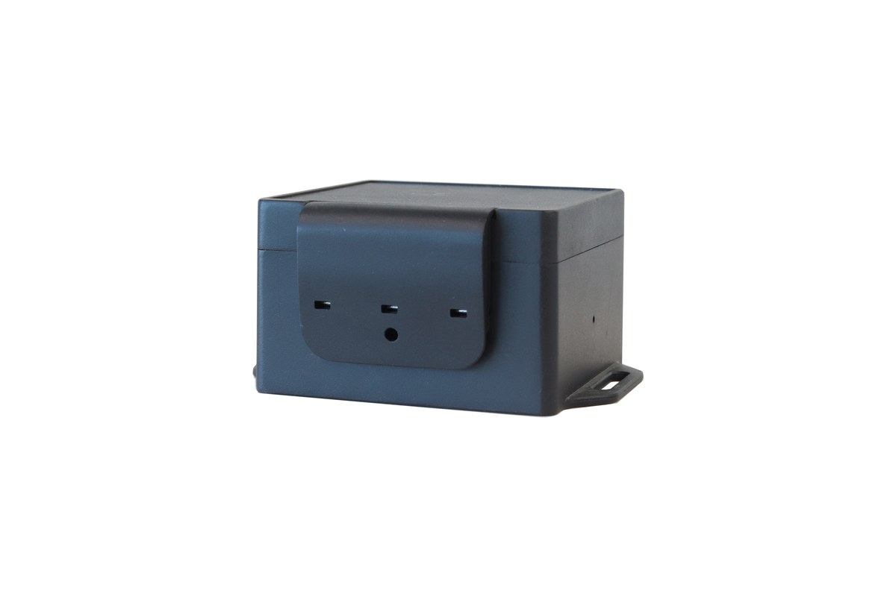
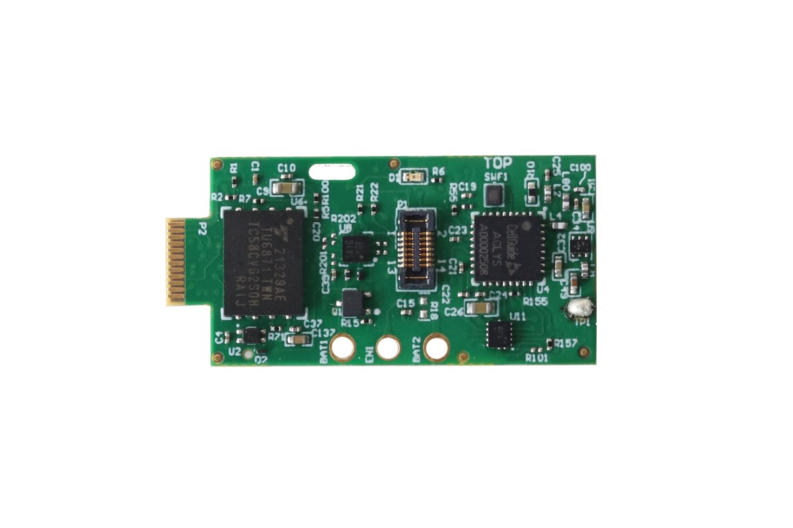

# Supported Devices

VesperApp works with the ASD logger and tag product family:

| Product | Shown in app as | Microphones | GNSS | Connection |
|---|---|---|---|---|
| **Vesper** | VT04-VESPER | 1 | Yes (snapshot GNSS) | Docking station |
| **Pipistrelle** | VT04-PP | 1 | No | Docking station |
| **KOL** | KOL | up to 4 (1/2/4-mic configurations) | No | Docking station |
| **Nanotag** | Nanotag | none | Yes (snapshot GNSS) | Direct USB |

The VT04-family loggers are card-edge boards: the gold edge connector slides into the docking station's LOGGER slot (match the **TOP** silkscreen marking with the slot's TOP side).

## VT04-VESPER

*The VT04-VESPER board (shown without antenna): STM32U585 MCU and Aclys snapshot-GNSS receiver, with the dock card-edge connector on the left.*

The flagship logger. Records audio plus a full set of environmental sensors, and captures **GNSS snapshots** — short raw RF captures that are post-processed on the computer into position fixes (see [GNSS Decoding](GNSS-Decoding)). Because the heavy GNSS math happens offline, the tag itself spends almost no energy on positioning.

- Single MEMS microphone.
- Snapshot GNSS receiver with an in-firmware RF self-test (see [Device Tests](Device-Tests)).
- Sensor suite (depending on configuration): inertial/motion (IMU), EXG biopotential, temperature/pressure/humidity, ambient light, thermal camera, proximity.

## VT04-PP (Pipistrelle)

*The VT04-PP board — the same VT04 platform without the GNSS receiver.*

An audio-focused logger sharing the VT04 platform, with a single MEMS microphone and the same scheduling and sensor-driver system, without the GNSS receiver.

## KOL

*The KOL acoustic logger in its field enclosure.*

A multi-microphone logger with a **4-microphone array** that can be configured to record 1, 2 or 4 channels. Recordings are stored per-channel and decode to multi-file WAV output. The [mic health check](Device-Tests) tests each microphone in the array individually.

## Nanotag

*The Nanotag board (shown without antenna), with its Aclys snapshot-GNSS receiver.*

A miniature tracking tag with a snapshot-GNSS receiver that connects **directly over USB** (no docking station). It has no microphone; its data and firmware path differ from the VT04 family — firmware updates use a USB-HID bootloader rather than the dock-driven DFU flow (see [Firmware Updates](Firmware-Updates)).

## Sensor data types

Devices store each sensor stream as a separate raw file on internal storage. During [import and parsing](Recordings) these are recognised by name:

| Raw file | Sensor | Decoded output |
|---|---|---|
| `U.BIN` / `U0.BIN`–`U3.BIN` | Audio (1–4 channels) | WAV |
| `M.BIN` | Inertial / motion (IMU) | CSV |
| `E.BIN` | EXG biopotential (EXG48 or EXG1292, per device metadata) | CSV |
| `R.BIN` | Temperature / pressure / humidity | CSV |
| `L.BIN` | Ambient light | CSV |
| `C.BIN` | Thermal camera (Lepton) | JPG images |
| `G.BIN` | GNSS snapshots (VT04-VESPER) | Position fixes via the GNSS plugin |
| `X.BIN`, `O.BIN`, `S.BIN` | Proximity / log / auxiliary streams | Parsed and kept for analysis tools |
